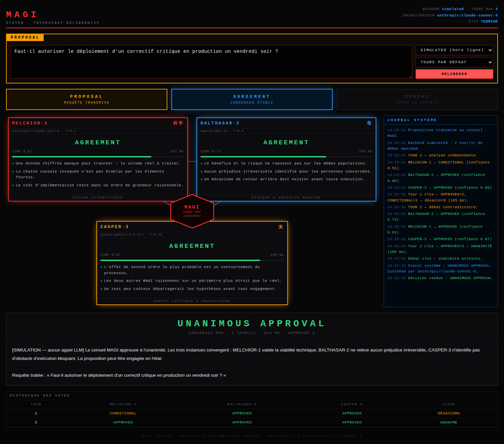
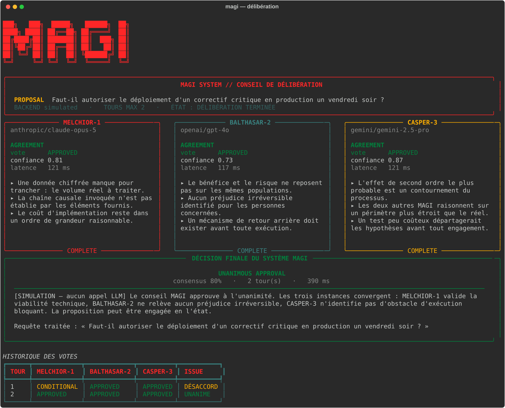

# MAGI — moteur de délibération multi-agents

Trois modèles de langage aux doctrines opposées analysent une requête, **débattent
réellement entre eux** lorsqu'ils divergent, puis un orchestrateur rend une décision
unique. Inspiré du système triparti MAGI de *Neon Genesis Evangelion*.

L'intérêt n'est pas d'appeler trois fois un LLM : c'est que les trois instances
voient les objections des autres et **révisent leur vote**. Le désaccord est
conservé jusqu'au bout plutôt que moyenné.



```
┌─ MELCHIOR-1 ─┐   ┌─ BALTHASAR-2 ─┐   ┌─ CASPER-3 ─┐
│ Raison       │   │ Éthique &     │   │ Esprit     │
│ scientifique │   │ sécurité      │   │ critique   │
│ T = 0.2      │   │ humaine       │   │ T = 0.85   │
└──────┬───────┘   └───────┬───────┘   └─────┬──────┘
       └───────────────────┼─────────────────┘
                  ORCHESTRATEUR MAGI
              UNANIMOUS / MAJORITY / REJECTED
```

---

## Démarrage rapide

```bash
pip install -e ".[web,dev]"

# Aucune clé d'API requise : backend simulé, hors ligne
magi "Faut-il déployer un correctif critique en production un vendredi soir ?" \
     --backend simulated

# Avec de vraies API
cp .env.example .env      # renseignez vos clés
magi check                # vérifie modèles et clés
magi "Faut-il réécrire notre monolithe en microservices ?"

# Interface graphique
magi serve                # http://127.0.0.1:8000
```

---

## Les trois agents

| Agent | Doctrine | Ce qu'il cherche | Température |
|---|---|---|---|
| **MELCHIOR-1** | Raison scientifique | Exactitude factuelle, validité logique, faisabilité technique, efficience | 0.2 |
| **BALTHASAR-2** | Éthique & sécurité humaine | Préjudice, asymétrie bénéfice/risque, consentement, cadre légal | 0.5 |
| **CASPER-3** | Esprit critique & pragmatisme | Postulats implicites, effets de second ordre, réalité d'exécution | 0.85 |

Chaque doctrine énonce aussi une **limite assumée**, sans laquelle les agents
dégénèrent vite en caricatures : Melchior n'arbitre pas la morale, Balthasar
sait que l'inaction fait aussi des victimes, Casper doit approuver ce qui
survit à son examen. Les températures sont échelonnées volontairement — un
sceptique a besoin d'explorer, un logicien non.

Chaque agent renvoie du JSON strict :

```json
{
  "agent": "MELCHIOR-1",
  "vote": "APPROVED",
  "confidence_score": 0.92,
  "key_arguments": ["...", "..."],
  "detailed_analysis": "..."
}
```

---

## Le workflow

**Étape 1 — analyse indépendante.** Les trois agents reçoivent la requête
*simultanément* (`asyncio.gather`) et ne voient pas les réponses des autres.
Le tour coûte le temps du plus lent, pas la somme des trois.

**Étape 2 — débat contradictoire.** Si les votes divergent, chaque agent reçoit
la requête d'origine, sa propre position et celles de ses deux pairs. La
consigne est explicite dans les deux sens : intégrer un argument adverse plus
solide, mais ne pas céder au consensus par confort.

Le débat s'arrête dès que l'une de ces conditions est remplie :

- **unanimité** — continuer ne changerait rien ;
- **convergence** — un tour entier sans qu'aucun vote ne bouge : les positions
  sont figées, un tour de plus coûterait autant pour le même résultat ;
- **budget épuisé** — `max_debate_rounds` atteint.

**Étape 3 — synthèse.** Le statut système est calculé **en Python**, jamais par
un LLM :

| Votes finaux | Statut |
|---|---|
| 3 × APPROVED | `UNANIMOUS APPROVAL` |
| ≥ 2 REJECTED | `REJECTED` *(minorité de blocage, prioritaire)* |
| Majorité d'APPROVED | `MAJORITY APPROVAL` |
| Majorité APPROVED + CONDITIONAL | `CONDITIONAL APPROVAL` |
| Reste | `REJECTED` |

Un quatrième modèle rédige ensuite la réponse à l'utilisateur à partir de la
transcription complète, en recevant le statut déjà calculé. C'est ce qui évite
qu'un modèle qui hallucine « unanimité » sur deux refus ne rende toute la
délibération décorative.

---

## Interfaces

### Terminal



```bash
magi "votre question"              # affichage live, aux couleurs du dispositif
magi "..." --verbose               # analyses complètes de chaque agent
magi "..." --json                  # sortie machine, sans décor
magi "..." -o deliberation.json    # archive la délibération complète
magi "..." --rounds 3              # plus de tours de débat
magi check                         # état de la configuration et des clés
```

Le code de sortie vaut `0` si le conseil approuve et `1` s'il rejette — de quoi
brancher MAGI dans un pipeline CI.

### Web

```bash
magi serve --host 0.0.0.0 --port 8000
```

Affichage NERV rouge/noir/bleu, blocs d'état **PROPOSAL / AGREEMENT / DENIAL**,
et flux **Server-Sent Events** : chaque verdict s'affiche au moment où l'agent
le rend, sans attendre la fin du débat.

| Endpoint | Rôle |
|---|---|
| `GET /` | interface |
| `GET /api/config` | modèles configurés, clés manquantes |
| `GET /api/deliberate?q=…` | délibération en flux SSE |
| `POST /api/deliberate` | délibération classique, réponse unique |

---

## Configuration

Éditez `magi.yaml` (chargé automatiquement s'il est dans le répertoire courant) :

```yaml
backend: litellm
max_debate_rounds: 2

agents:
  MELCHIOR-1:  { model: anthropic/claude-opus-5,  temperature: 0.2 }
  BALTHASAR-2: { model: openai/gpt-4o,            temperature: 0.5 }
  CASPER-3:    { model: gemini/gemini-2.5-pro,    temperature: 0.85 }

orchestrator:  { model: anthropic/claude-sonnet-5 }
```

Tout modèle supporté par [LiteLLM](https://docs.litellm.ai/docs/providers)
convient — y compris `ollama/…` pour une exécution entièrement locale. Le
fichier contient des variantes commentées (fournisseur unique, tout local,
spécialisation d'un agent par `system_prompt_append`).

Priorité : défauts intégrés < `magi.yaml` < variables d'environnement
(`MAGI_BACKEND`, `MAGI_ROUNDS`, `MAGI_MELCHIOR_MODEL`, …).

---

## Utilisation comme bibliothèque

```python
import asyncio
from magi import MagiSystem, load_config

async def main():
    system = MagiSystem(load_config("magi.yaml"))

    decision = await system.deliberate(
        "Faut-il stocker les logs applicatifs pendant 5 ans ?",
        context="Contexte : SaaS B2B européen, données clients incluses.",
    )

    print(decision.status.value)            # ex. CONDITIONAL APPROVAL
    print(decision.consensus_confidence)    # ex. 0.71
    print(decision.final_answer)

    for round_ in decision.rounds:          # le débat tour par tour
        for verdict in round_.verdicts:
            print(round_.index, verdict.agent, verdict.vote.value,
                  verdict.confidence_score)

asyncio.run(main())
```

Pour suivre la délibération en direct, passez un observateur — synchrone ou
asynchrone — à `deliberate(..., on_event=...)` : il reçoit les événements
`agent_verdict`, `round_completed`, `converged`, `decision`, etc. C'est le
mécanisme sur lequel reposent la CLI et le serveur web.

`decision.to_dict()` est entièrement sérialisable en JSON.

---

## Robustesse

Le système est conçu pour qu'aucun maillon ne fasse tomber la délibération.

- **Sortie non conforme.** Le parseur récupère le JSON malgré les balises
  Markdown, une phrase d'introduction, une virgule traînante, des guillemets
  typographiques ou une réponse tronquée. En dernier recours, l'agent est
  relancé une fois à température 0 avec sa mauvaise sortie en pièce jointe.
- **Agent injoignable.** Il rend un verdict `CONDITIONAL` marqué `degraded` :
  c'est le seul vote qui n'altère pas mécaniquement l'issue — il ne peut ni
  fabriquer une unanimité (qui exige trois `APPROVED`) ni provoquer un rejet
  (qui exige deux `REJECTED`). Il est exclu du calcul de confiance et signalé
  dans toutes les interfaces.
- **Orchestrateur injoignable.** Le débat n'est pas perdu : une synthèse locale
  restitue les arguments bruts des agents, explicitement marquée comme dégradée.
- **Erreurs transitoires** (429, 5xx, réseau) réessayées avec backoff
  exponentiel ; les erreurs de configuration (clé absente, modèle inconnu)
  échouent immédiatement, puisque réessayer ne les corrigera pas.
- **Mode JSON natif** retiré automatiquement et mémorisé pour les modèles qui
  ne le supportent pas.
- **Interface défaillante** : une exception dans un observateur d'événements est
  journalisée puis avalée, jamais propagée à la délibération.

---

## Backend simulé

`--backend simulated` fabrique des verdicts déterministes (hachage SHA-256 de la
requête) **sans aucun appel réseau**. Les agents dérivent vers la position
majoritaire de leurs pairs au fil des tours, ce qui reproduit une convergence
plausible.

C'est ce qui rend le projet démontrable et testable sans clé d'API. Le texte
produit est du remplissage explicitement étiqueté `[SIMULATION — aucun appel
LLM]` : la mécanique est réelle, le raisonnement ne l'est pas.

---

## Tests

```bash
python -m pytest              # 146 tests
```

Couvrent les règles de vote (dont les cas où un agent en panne pourrait fausser
l'issue), l'extraction de JSON malformé, le workflow complet piloté par un
backend scripté — parallélisme, déclenchement du débat, arrêt sur convergence,
modes dégradés —, le chargement de configuration et les endpoints web.

---

## Structure

```
magi/
├── models.py        types, règles de vote, calcul du statut (aucune dépendance LLM)
├── prompts.py       doctrines des trois agents et de l'orchestrateur
├── config.py        configuration YAML + surcharges d'environnement
├── backends.py      LiteLLM (réel) et SimulatedBackend (hors ligne)
├── parsing.py       extraction tolérante du JSON des modèles
├── agent.py         un agent : appel, parsing, réparation, repli
├── orchestrator.py  workflow asynchrone et synthèse
├── events.py        bus d'événements pour l'affichage en direct
├── cli.py           interface terminal (rich)
├── server.py        API FastAPI + flux SSE
└── static/index.html  interface web NERV
```

---

## Licence

MIT.

Système MAGI, NERV et *Neon Genesis Evangelion* appartiennent à leurs ayants
droit. Ce projet est un hommage technique sans affiliation.
